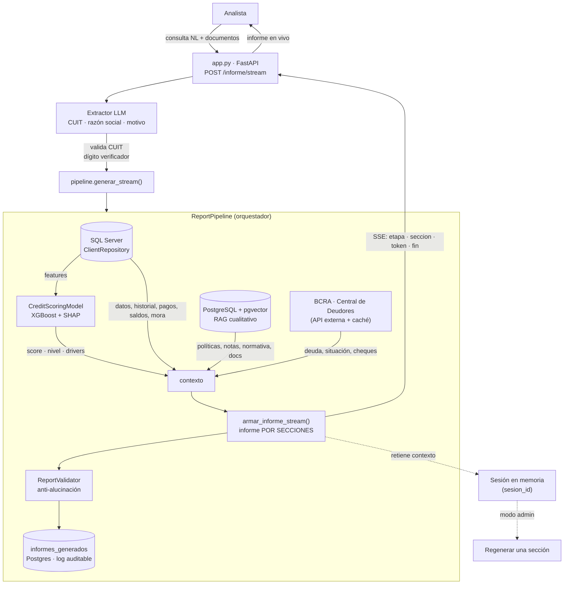
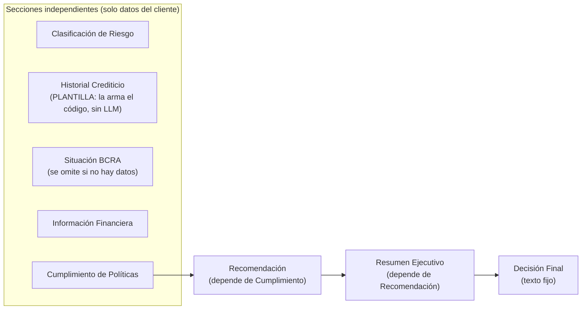

# Arquitectura y flujo de datos

El sistema transforma una **consulta en lenguaje natural** sobre un asociado en
un **informe crediticio ejecutivo**, combinando datos estructurados, un modelo
estadístico, recuperación de contexto (RAG) e integración con el BCRA, y
redactándolo con un LLM **por secciones** bajo reglas anti-alucinación.

## Diagrama de flujo (punta a punta)

## Las cuatro capas

1. **Datos estructurados — SQL Server.** `ClientRepository` (en `db/`) obtiene
   datos básicos, historial de préstamos, comportamiento de pagos, saldos,
   gestiones de mora y las *features* para el modelo.
2. **Scoring ML — XGBoost.** `CreditScoringModel` (`ml/scoring_model.py`) predice
   la probabilidad de incumplimiento → score (0–1000) + nivel de riesgo, con los
   *drivers* propios del asociado (SHAP, `ml/shap_explainer.py`).
3. **Contexto cualitativo — RAG con pgvector.** `PGVectorRetriever` recupera por
   similitud semántica políticas internas, notas de mora, normativa, informes
   previos y documentos aportados. El perfil BCRA también se indexa acá.
4. **Redacción — LLM por secciones.** `armar_informe_stream`
   (`llm/report_sections.py`) genera cada sección con su prompt especializado y
   solo el contexto que necesita.

## Generación por secciones

En vez de un único prompt monolítico, cada sección tiene su prompt y recibe un
contexto acotado. Esto enfoca las reglas, acorta cada llamada (no se trunca con
historiales largos) y reduce la confusión/alucinación.

**Historial Crediticio no pasa por el LLM.** Es una sección puramente factual —
transcribe números ya calculados—, y pedirle a un modelo que "solo formatee" le
daba igual la oportunidad de contar mal la cartera, cerrar el período en el año
equivocado o contradecir a otra sección (era la alucinación CRÍTICA más
frecuente del juez). Se arma con código en `llm/plantillas.py`: cero alucinación
y, además, testeable (`tests/test_plantilla_historial.py`). Los agregados de la
cartera se pasan al resto de las secciones **ya redactados** en
`cartera_resumen.frase`, para que sólo tengan que transcribirlos.

- **Orden de ejecución/streaming:** secciones independientes → Recomendación →
  Resumen → Decisión Final.
- **Orden de lectura (documento final):** Resumen arriba, luego las secciones, la
  Recomendación y la Decisión Final. El ensamble final se emite en el evento
  `informe`.
- Los **importes** se pre-formatean a pesos argentinos (string) *antes* de
  pasarlos al LLM (`_fmt_montos_contexto`), para que los transcriba tal cual y no
  reinterprete el separador decimal. El contexto crudo se conserva para el
  validador, el log y el juez.

## Decisiones de diseño

- **Prompts externalizados** (`prompts/*.txt`, cargados en fresco con `load()`):
  un experto de dominio los edita sin tocar código y el cambio impacta en el
  próximo informe sin reiniciar. Habilita el [modo admin](modo-admin.md).
- **Anti-alucinación:** el LLM solo usa el contexto provisto; el `ReportValidator`
  chequea que estén las secciones, que el score aparezca en el texto y que cierre
  con el disclaimer de decisión humana. Un **juez LLM** (`evaluation/llm_judge.py`)
  audita el informe contra los datos fuente.
- **Explicabilidad por cliente (SHAP):** factores del score de *ese* asociado, con
  dirección y peso.
- **Privacidad / on-premise:** puede correr 100% local (Ollama + embeddings
  locales); el BCRA es opcional (`BCRA_ENABLED`).
- **Auditabilidad:** cada informe se registra en `informes_generados` con su
  trazabilidad (modelos, fuentes, validación).

## Camino "sin datos internos"

Si el CUIT no está en la base interna, el pipeline **no corta**: genera un informe
acotado con la identificación provista y, si `BCRA_ENABLED`, con lo que devuelva
la Central de Deudores. Este camino usa un prompt propio (`prompts/sin_datos_*`)
y **no** crea sesión de regeneración (el informe es un bloque único, no por
secciones).
