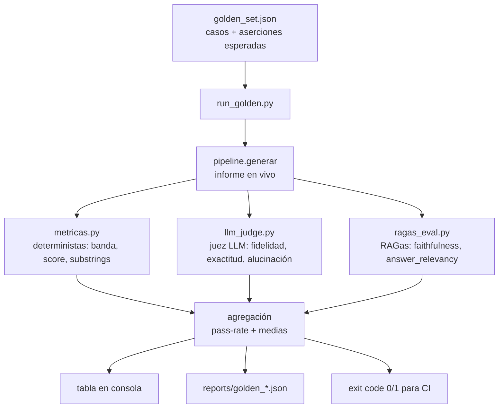

# Evaluación automatizada (golden set + juez LLM + RAGas)

Antes, la evaluación auditaba **un CUIT por vez** (`evaluation/run_judge.py`): útil
para inspeccionar un caso, pero sin conjunto fijo de casos ni métricas agregadas,
así que no permitía responder "¿mejoró o empeoró el sistema con este cambio?".

Este módulo agrega una evaluación **repetible y agregada**: un *golden set* de
casos con aserciones **pass/fail**, sobre el que se corren tres familias de
métricas y se reporta un pass-rate global. Está pensado para colgarse de CI (el
runner devuelve exit code ≠ 0 si algún caso falla).

> Responde a la devolución del profesor: *"la evaluación conviene automatizarla:
> ahora audita un CUIT por vez, sin golden set ni métricas agregadas; monta un
> conjunto de casos con pass/fail y añade RAGas"*.

## Flujo



## Componentes

| Archivo | Responsabilidad |
|---|---|
| `evaluation/golden_set.json` | Los casos: motivo + aserciones esperadas. Esquema autodocumentado en la clave `_esquema_caso`. **No lleva los CUIT** (ver más abajo). |
| `evaluation/golden_cuits.local.json` | Los CUIT reales, indexados por `id` de caso. **No se versiona.** Lo escribe el sampler y `run_golden.py` lo superpone al cargar. |
| `evaluation/muestrear_cuits.py` | Siembra el golden set con CUITs reales **estratificados por banda de riesgo** (no sólo clientes buenos). |
| `evaluation/metricas.py` | Chequeos **pass/fail** deterministas + umbrales sobre juez y RAGas. Un valor esperado `null` omite ese chequeo. |
| `evaluation/llm_judge.py` | Juez LLM que compara el informe contra los datos fuente (ya existía; se reutiliza). |
| `evaluation/ragas_eval.py` | Métricas RAGas (`faithfulness`, `answer_relevancy`) cableadas a OpenAI. Degrada a vacío si RAGas no está instalado. |
| `evaluation/run_golden.py` | Runner: itera el set, combina las tres familias, agrega y reporta. |
| `evaluation/comparar_reportes.py` | Compara dos reportes lado a lado (evaluación comparativa de generadores). |

## Las tres familias de métricas

1. **Deterministas** (sin LLM, baratas y estables): la banda de riesgo cae dentro
   del conjunto aceptable, el score está en rango, aparecen los substrings
   obligatorios (ej. el CUIT, el score) y no aparecen los prohibidos, y el caso
   "encontrado / no encontrado" se resuelve como se esperaba.
2. **Juez LLM**: puntaje promedio ≥ umbral sobre los criterios (fidelidad,
   exactitud numérica, estructura, uso de drivers, coherencia), **ausencia de
   alucinaciones CRÍTICAS** y cumplimiento de reglas. Usa un modelo
   **distinto/más fuerte** que el generador.

   > **Alucinaciones por severidad.** El juez clasifica cada alucinación en
   > `CRITICA` (inventa o cambia un número/hecho verificable —ej. "sin atrasos"
   > cuando hay atrasos) o `MENOR` (una inferencia o matiz sin sustento que no
   > altera ningún dato). El check `sin_alucinaciones` gatea **sólo por las
   > CRÍTICAS**; las menores se reportan pero no reprueban. Sin esta distinción,
   > un umbral de "cero alucinaciones" reprobaba casi todos los informes —incluso
   > los de un modelo fuerte— y no discriminaba calidad.
3. **RAGas**: `faithfulness` (¿cada afirmación del informe se sostiene en el
   contexto recuperado del RAG?). Mide la calidad del pipeline RAG sin ground
   truth escrito a mano, y sí decide pass/fail.

   > **`answer_relevancy` está apagada por defecto — medido, no supuesto.**
   > Su fórmula interna es
   > `score = cosine_sim(motivo, preguntas_generadas).mean() * int(not all_noncommittal)`,
   > y el segundo factor la colapsa a **0 exacto** cuando el LLM juzga la
   > respuesta "noncommittal". Comprobado el 29-ago-2026 sobre informes reales:
   >
   > | Entrada | `noncommittal` | score |
   > |---|---|---|
   > | Informe completo (5.458 ch) | `[1,1,1]` | 0,0 |
   > | Sólo la sección Recomendación (900 ch) | `[1,1,1]` | 0,0 |
   > | Control: respuesta corta y tajante, mismo contenido | `[0,0,0]` | >0 |
   >
   > No es la forma de la pregunta (se probó el motivo tal cual, reformulado como
   > pregunta y una pregunta genérica: las tres dan 0) ni el largo (la sección
   > sola también da 0). Las preguntas que genera son correctas — el problema es
   > el flag. La métrica está pensada para Q&A corto y un informe multi-sección
   > nunca tiene esa forma.
   >
   > Lo que la descalifica no es el sesgo sino que el colapso es **intermitente**:
   > 2 de 8 casos por corrida, y *casos distintos en cada corrida*. Eso inyecta
   > ruido en vez de medir. Ningún caso gateaba por ella (todos los umbrales en
   > `null`), así que apagarla no cambia ningún veredicto y ahorra 3 llamadas al
   > LLM por caso. Se reactiva con `RAGAS_RESPONSE_RELEVANCY=1`.

   > **Contexto que ve RAGas.** Se le pasan los chunks recuperados del RAG
   > (`contexto["rag"]`: políticas, normativa, BCRA, notas), no el contexto
   > estructurado completo. `faithfulness` mide entonces la fidelidad del informe
   > a esa capa cualitativa recuperada.

Un caso **pasa** sólo si **todos** sus chequeos *activos* (con umbral no-null) pasan.

## Cómo se corre

```bash
# 1) (una vez) sembrar el golden set con clientes reales de la base
python evaluation/muestrear_cuits.py --por-banda 3 --salida casos.json
#    → los CUIT van solos a evaluation/golden_cuits.local.json (no versionado);
#      casos.json sale con "COMPLETAR" en su lugar.
#    → pegar las entradas de casos.json en el array "casos" de golden_set.json,
#      revisar los motivos y ajustar las aserciones a mano.
#    (sin --salida imprime a stdout; --salida evita que los logs [DBG] del modelo
#     ensucien el JSON)

# 2) instalar las deps de evaluación
pip install ragas datasets

# 3) correr la evaluación completa
python evaluation/run_golden.py
python evaluation/run_golden.py --sin-ragas     # más rápido, sólo deterministas + juez
python evaluation/run_golden.py --juez openai   # proveedor del juez (default openai)

# comparar GENERADORES sobre el mismo golden set (el juez discrimina calidad):
python evaluation/run_golden.py --generador gemma4:latest --etiqueta gemma4
python evaluation/run_golden.py --generador anthropic     --etiqueta opus
#   cada corrida guarda un reporte etiquetado en evaluation/reports/golden_<etiqueta>_<ts>.json
python evaluation/comparar_reportes.py          # tabla lado a lado de los 2 últimos reportes
```

> **Un mismo golden set discrimina generadores.** El generador que produce el
> informe se elige con `--generador` (o la env `PROVEEDOR_LLM`). Corriendo el
> mismo set con un modelo local chico vs. uno fuerte, el pass-rate agregado y el
> promedio del juez muestran objetivamente cuál alucina menos — que es
> exactamente la evaluación objetiva que pedía la devolución.

Variables de entorno relevantes:

| Variable | Default | Para qué |
|---|---|---|
| `PROVEEDOR_LLM` | `local` | Modelo que **genera** los informes que se evalúan. |
| `EVAL_LLM_PROVIDER` | `openai` | Proveedor del **juez LLM**. |
| `RAGAS_LLM_MODEL` | `gpt-4o-mini` | Modelo que usa **RAGas**. Debe ser **no-razonador**: RAGas fija la `temperature` al invocar y los modelos `gpt-5*`/`o1`/`o3`/`o4*` rechazan `temperature != 1` (las métricas saldrían `nan`). |
| `RAGAS_EMBED_MODEL` | `text-embedding-3-small` | Embeddings de RAGas (`answer_relevancy`). |
| `RAGAS_TIMEOUT` | `600` | Segundos por evaluación RAGas. `faithfulness` descompone el informe en afirmaciones y verifica cada una; en informes largos el default de RAGas (180s) se queda corto y devuelve `NaN`. |
| `OPENAI_API_KEY` | — | Requerida por juez y RAGas. |

> **Métricas RAGas no disponibles no penalizan.** Si `faithfulness` no se pudo
> calcular (RAGas no instalado, sin contexto recuperado, o timeout → `NaN`), el
> check se **omite** en vez de contar como fallo: es un problema de infraestructura,
> no de calidad del informe. Los promedios agregados también ignoran los `NaN`.

> **Nota de compatibilidad.** RAGas importa `langchain_community.chat_models.vertexai`,
> módulo removido en langchain-community 0.4.x (el que usa el proyecto). `ragas_eval.py`
> inyecta un stub de ese módulo antes de importar RAGas — nunca se instancia Vertex,
> así que el placeholder alcanza. Es transparente: no hace falta hacer nada.

## Salida

- **Tabla en consola** por caso (pass, checks OK/total, promedio del juez,
  faithfulness, answer_relevancy) + **resumen agregado** (pass-rate de casos y de
  checks, medias del juez y RAGas).
- **Reporte JSON** en `evaluation/reports/golden_<timestamp>.json` con el detalle
  de cada chequeo (versionado ignorado por git; sirve como evidencia de una corrida).
- **Exit code** `0` si todos los casos pasan, `1` si alguno falla, `2` si el
  golden set no tiene casos con CUIT completado (típicamente: falta
  `golden_cuits.local.json`, que no se versiona — regeneralo con el sampler).

## Por qué los CUIT no están en el repo

Los casos apuntan a clientes reales, y en esta cartera son **personas físicas**:
un CUIT `20-…` contiene el DNI. Publicarlos en el golden set los dejaría en un
repo público, cada uno etiquetado por su banda de riesgo crediticio (el `id` del
caso es `alto_1`, `muy_alto_2`…). Eso es dato personal financiero de gente
identificable, y una vez indexado no se revierte borrando el commit.

La separación es la mínima que preserva las dos cosas que importan:

- `golden_set.json` **se versiona completo** — estructura, motivos, aserciones,
  umbrales. Es lo que hace auditable y reproducible el harness, y es lo que hay
  que poder leer para juzgar si la evaluación es seria.
- `golden_cuits.local.json` **queda en la máquina**. `muestrear_cuits.py` lo
  escribe siempre por separado, así que no hay forma de filtrar identificadores
  al archivo público copiando y pegando su salida.

Correr el harness en otra máquina es entonces re-sembrar contra la base, que es
lo que hay que hacer igual: las bandas se mueven con el tiempo y un set viejo
evalúa un cliente que ya no es el que dice ser.

## Diseño del golden set

- **Estratificado por banda**: el sampler elige clientes de `BAJO`, `MODERADO`,
  `ALTO` y `MUY ALTO`, para que la evaluación cubra tanto aprobaciones como
  rechazos y no sólo el caso fácil.
- **Caso negativo**: incluye al menos un CUIT inexistente para verificar que el
  sistema marca "no encontrado" y **no inventa** datos ni score.
- **Aserciones tolerantes por diseño**: la banda esperada es un *conjunto*
  (ej. `["BAJO","MODERADO"]`), no un valor exacto, porque el objetivo es detectar
  regresiones groseras, no fijar el modelo a una predicción puntual.
- **Sampler al corte de hoy**: `muestrear_cuits.py` puntúa al **mismo cutoff que
  el eval** (hoy) para que la banda esperada coincida con la que el pipeline
  calcula al correr. Con un cutoff viejo, el riesgo real del cliente cambia (el
  modelo lo refleja) y `banda_riesgo` falla espuriamente. Al re-sembrar el set,
  el sampler no aplica el filtro de elegibilidad de entrenamiento (que excluye a
  los ya-defaulteados), porque esos son justamente los `MUY ALTO` que se quieren
  cubrir.

## Varianza del harness

El pass/fail agregado es un número chico sobre una base chica: 9 casos, veredicto
binario por caso. Un solo caso que cambia de humor mueve el resultado 11 puntos.
En julio se observó la secuencia **6/9 → 5/9 → 4/9 mientras las métricas
continuas mejoraban** (juez 3,95 → 4,03; faithfulness 0,809 → 0,855), y —lo
decisivo— *los casos que fallaban no eran los mismos en cada corrida*.

Eso obliga a una pregunta previa a cualquier optimización: **¿cuánto se mueve el
resultado sin cambiar nada?** Si el ruido entre corridas idénticas es del mismo
orden que la mejora que se busca, el número no sirve para decidir y se termina
persiguiendo el azar del muestreo del modelo.

`evaluation/varianza.py` responde eso. Se corre el golden set N veces sin tocar
nada (mismo código, mismo set, misma config) y el script reporta:

- **Piso de ruido por métrica** — media, desvío, rango y coeficiente de variación.
  El `cv` es lo que permite comparar el ruido del pass/fail (una tasa 0-1) con el
  del juez (0-5), que viven en escalas distintas.
- **Estabilidad por caso** — cuántas veces pasó cada uno. Un caso que pasa en
  algunas corridas y falla en otras, *con el mismo código*, es ruido puro; separa
  el ruido del techo real del modelo (los que fallan siempre).
- **Checks que cambian de veredicto** — qué chequeo concreto se mueve. Es lo que
  dice si el ruido está en el juez, en RAGas o en las aserciones deterministas.
- **Umbral de decisión** — cuánto tiene que mejorar una métrica para ser creíble.
  Con `n` corridas por configuración, el umbral aproximado es `2·sd·√(2/n)`. Una
  mejora por debajo de eso no probó nada.

```bash
# correr el mismo set 3 veces
for i in 1 2 3; do python evaluation/run_golden.py --etiqueta "var$i"; done

# analizar la varianza
python evaluation/varianza.py --etiqueta var
```

Tres corridas es el mínimo útil (con dos, el desvío no es interpretable), y aun
con tres el desvío es una estimación gruesa: sirve para el orden de magnitud, no
para el tercer decimal.

### Resultado medido (29-ago-2026, gemma4:latest, 3 corridas idénticas)

| Métrica | Corrida 1 | Corrida 2 | Corrida 3 | sd | **cv** |
|---|---|---|---|---|---|
| **Casos que pasan** | 3/9 (33%) | 5/9 (56%) | 4/9 (44%) | 0,112 | **25,1 %** |
| **Checks que pasan** | 40/49 | 40/49 | 41/49 | 0,012 | **1,5 %** |
| **Juez (0-5)** | 4,15 | 4,20 | 4,25 | 0,050 | **1,2 %** |
| RAGas faithfulness | 0,832 | 0,826 | 0,774 | 0,032 | 3,9 % |

**El pass/fail por caso es ~21× más ruidoso que el juez.** La comparación entre
las corridas 1 y 2 lo muestra sin necesidad de estadística: pasaron **exactamente
los mismos 40 checks de 49** en las dos, y sin embargo una dio 3/9 casos y la
otra 5/9. El sistema rindió lo mismo; lo único que cambió fue **cómo se
repartieron los 9 checks fallidos entre los casos**. Dos fallos que caen en un
caso que ya fallaba no cuestan nada; los mismos dos fallos repartidos en dos
casos distintos cuestan dos casos. Eso es azar de agrupamiento, no calidad.

Traducido a umbrales de decisión (`2·sd·√(2/n)`, ~95 %):

| Métrica | Umbral con 1 corrida | Umbral con 3 corridas |
|---|---|---|
| Casos que pasan | **0,315** (≈ 2,8 casos de 9) | 0,182 (≈ 1,6 casos) |
| Checks que pasan | 0,034 | 0,020 |
| Juez | 0,141 | 0,082 |
| Faithfulness | 0,090 | 0,052 |

**Consecuencia incómoda pero honesta:** las mejoras celebradas en julio
(44 % → 67 % de casos, +0,223) **no superan el umbral de una sola corrida
(0,315)**. Eso no dice que los arreglos fueran inútiles — el bug del resumen de
pagos y el conteo de cartera eran defectos reales y verificados uno por uno, y
las métricas continuas sí mejoraron. Dice que *el número de casos no fue lo que
lo demostró*.

Para que el pass/fail por caso detectara una mejora de un solo caso harían falta
**~9 corridas por configuración** (unas 4,5 h). Con el juez alcanzan 2 o 3.

### Cómo decidir, entonces

1. **Métrica de decisión: el juez y los checks**, no el pass/fail por caso.
   `checks_pass_rate` es casi tan estable como el juez (cv 1,5 %) y además es
   interpretable: dice *cuántas aserciones* se cumplen, sin el efecto umbral.
2. **El pass/fail queda como resumen de reporte**, no como criterio. El exit code
   sigue sirviendo para CI (detecta que algo se rompió del todo), no para medir
   progreso fino.
3. **Un cambio se acepta si mueve el juez más de 0,14** (una corrida) **o más de
   0,08** (promedio de tres). Por debajo de eso, no se probó nada.
4. **Separar ruido de techo**: los casos que fallan *siempre* son señal; los que
   alternan son ruido (`bajo_1`, `bajo_2` al 29-ago: no vale optimizarlos). Pero
   "señal" no quiere decir "defecto del generador" — hay que abrir cada uno.
   Corriendo opus sobre los cuatro que gemma4 falla siempre: `alto_1`,
   `alto_2` y `moderado_2` los pasa (era techo del modelo local), `moderado_1`
   falla por **golden set vencido** y `muy_alto_2` por un **bug de datos**
   nuestro. Ninguno era un defecto del generador. Ver `docs/estado-y-produccion.md`
   §4.4e.

5. **Re-sembrar el set es parte del procedimiento, no un paso inicial.** El caso
   `moderado_1` fue muestreado como MODERADO en julio y en agosto el modelo lo
   puntúa MUY ALTO: el riesgo del cliente se movió y `banda_riesgo` falla sin que
   nada esté roto. Vino fallando espuriamente en todas las corridas del 29-ago,
   con los dos generadores. Antes de una medición que importe, re-sembrar.
6. El check que más alterna es **`sin_alucinaciones`** (5 de los 10 flips), lo
   que era esperable: depende del juicio de un LLM sobre texto generado por otro.

> **Cuidado con el desvío**: está estimado con 3 corridas, así que es una
> aproximación gruesa (el intervalo de confianza de un sd con 2 grados de
> libertad es ancho). Sirve para el orden de magnitud —"el pass/fail es un orden
> más ruidoso que el juez"— no para el tercer decimal.
