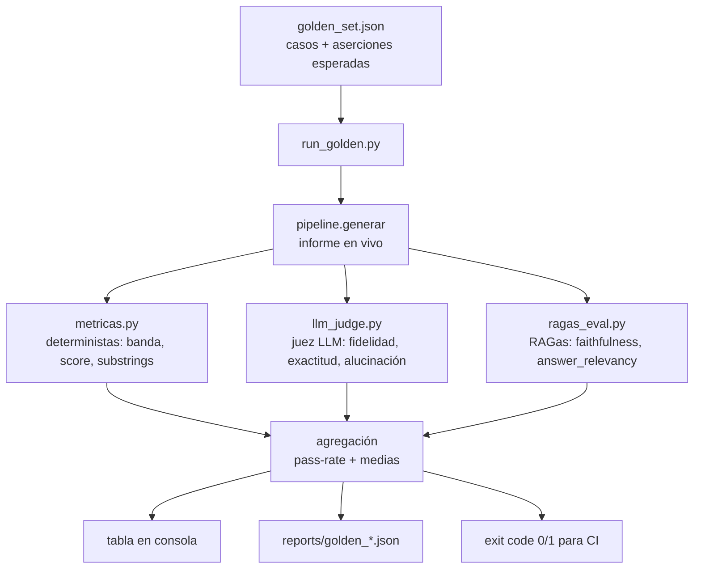

# Evaluación automatizada (golden set + juez LLM + RAGas)

Antes, la evaluación auditaba **un CUIT por vez** (`evaluation/run_judge.py`): útil
para inspeccionar un caso, pero sin conjunto fijo de casos ni métricas agregadas,
así que no permitía responder "¿mejoró o empeoró el sistema con este cambio?".

Este módulo agrega una evaluación **repetible y agregada**: un *golden set* de
casos con aserciones **pass/fail**, sobre el que se corren tres familias de
métricas y se reporta un pass-rate global. Está pensado para colgarse de CI (el
runner devuelve exit code ≠ 0 si algún caso falla).

> Responde a la devolución del profesor: *"la evaluación conviene automatizarla:
> ahora audita un CUIT por vez, sin golden set ni métricas agregadas; monta un
> conjunto de casos con pass/fail y añade RAGas"*.

## Flujo



## Componentes

| Archivo | Responsabilidad |
|---|---|
| `evaluation/golden_set.json` | Los casos: motivo + aserciones esperadas. Esquema autodocumentado en la clave `_esquema_caso`. **No lleva los CUIT** (ver más abajo). |
| `evaluation/golden_cuits.local.json` | Los CUIT reales, indexados por `id` de caso. **No se versiona.** Lo escribe el sampler y `run_golden.py` lo superpone al cargar. |
| `evaluation/muestrear_cuits.py` | Siembra el golden set con CUITs reales **estratificados por banda de riesgo** (no sólo clientes buenos). |
| `evaluation/metricas.py` | Chequeos **pass/fail** deterministas + umbrales sobre juez y RAGas. Un valor esperado `null` omite ese chequeo. |
| `evaluation/llm_judge.py` | Juez LLM que compara el informe contra los datos fuente (ya existía; se reutiliza). |
| `evaluation/ragas_eval.py` | Métricas RAGas (`faithfulness`, `answer_relevancy`) cableadas a OpenAI. Degrada a vacío si RAGas no está instalado. |
| `evaluation/run_golden.py` | Runner: itera el set, combina las tres familias, agrega y reporta. |
| `evaluation/comparar_reportes.py` | Compara dos reportes lado a lado (evaluación comparativa de generadores). |

## Las tres familias de métricas

1. **Deterministas** (sin LLM, baratas y estables): la banda de riesgo cae dentro
   del conjunto aceptable, el score está en rango, aparecen los substrings
   obligatorios (ej. el CUIT, el score) y no aparecen los prohibidos, y el caso
   "encontrado / no encontrado" se resuelve como se esperaba.
2. **Juez LLM**: puntaje promedio ≥ umbral sobre los criterios (fidelidad,
   exactitud numérica, estructura, uso de drivers, coherencia), **ausencia de
   alucinaciones CRÍTICAS** y cumplimiento de reglas. Usa un modelo
   **distinto/más fuerte** que el generador.

   > **Alucinaciones por severidad.** El juez clasifica cada alucinación en
   > `CRITICA` (inventa o cambia un número/hecho verificable —ej. "sin atrasos"
   > cuando hay atrasos) o `MENOR` (una inferencia o matiz sin sustento que no
   > altera ningún dato). El check `sin_alucinaciones` gatea **sólo por las
   > CRÍTICAS**; las menores se reportan pero no reprueban. Sin esta distinción,
   > un umbral de "cero alucinaciones" reprobaba casi todos los informes —incluso
   > los de un modelo fuerte— y no discriminaba calidad.
3. **RAGas**: `faithfulness` (¿cada afirmación del informe se sostiene en el
   contexto recuperado del RAG?) y `answer_relevancy` (¿la respuesta responde al
   motivo?). Miden la calidad del pipeline RAG sin ground truth escrito a mano.

   > **`answer_relevancy` es informativa (no gatea pass/fail).** RAGas la calcula
   > regenerando "preguntas" desde la respuesta y comparándolas con la pregunta
   > original. Acá el "motivo" es una *solicitud de decisión* (no una pregunta) y
   > el informe es un *análisis completo* (no una respuesta Q&A), así que la métrica
   > tiende a 0 por desajuste estructural, no por baja calidad. Se reporta como
   > referencia pero su umbral está en `null`. `faithfulness` sí decide pass/fail.

   > **Contexto que ve RAGas.** Se le pasan los chunks recuperados del RAG
   > (`contexto["rag"]`: políticas, normativa, BCRA, notas), no el contexto
   > estructurado completo. `faithfulness` mide entonces la fidelidad del informe
   > a esa capa cualitativa recuperada.

Un caso **pasa** sólo si **todos** sus chequeos *activos* (con umbral no-null) pasan.

## Cómo se corre

```bash
# 1) (una vez) sembrar el golden set con clientes reales de la base
python evaluation/muestrear_cuits.py --por-banda 3 --salida casos.json
#    → los CUIT van solos a evaluation/golden_cuits.local.json (no versionado);
#      casos.json sale con "COMPLETAR" en su lugar.
#    → pegar las entradas de casos.json en el array "casos" de golden_set.json,
#      revisar los motivos y ajustar las aserciones a mano.
#    (sin --salida imprime a stdout; --salida evita que los logs [DBG] del modelo
#     ensucien el JSON)

# 2) instalar las deps de evaluación
pip install ragas datasets

# 3) correr la evaluación completa
python evaluation/run_golden.py
python evaluation/run_golden.py --sin-ragas     # más rápido, sólo deterministas + juez
python evaluation/run_golden.py --juez openai   # proveedor del juez (default openai)

# comparar GENERADORES sobre el mismo golden set (el juez discrimina calidad):
python evaluation/run_golden.py --generador gemma4:latest --etiqueta gemma4
python evaluation/run_golden.py --generador anthropic     --etiqueta opus
#   cada corrida guarda un reporte etiquetado en evaluation/reports/golden_<etiqueta>_<ts>.json
python evaluation/comparar_reportes.py          # tabla lado a lado de los 2 últimos reportes
```

> **Un mismo golden set discrimina generadores.** El generador que produce el
> informe se elige con `--generador` (o la env `PROVEEDOR_LLM`). Corriendo el
> mismo set con un modelo local chico vs. uno fuerte, el pass-rate agregado y el
> promedio del juez muestran objetivamente cuál alucina menos — que es
> exactamente la evaluación objetiva que pedía la devolución.

Variables de entorno relevantes:

| Variable | Default | Para qué |
|---|---|---|
| `PROVEEDOR_LLM` | `local` | Modelo que **genera** los informes que se evalúan. |
| `EVAL_LLM_PROVIDER` | `openai` | Proveedor del **juez LLM**. |
| `RAGAS_LLM_MODEL` | `gpt-4o-mini` | Modelo que usa **RAGas**. Debe ser **no-razonador**: RAGas fija la `temperature` al invocar y los modelos `gpt-5*`/`o1`/`o3`/`o4*` rechazan `temperature != 1` (las métricas saldrían `nan`). |
| `RAGAS_EMBED_MODEL` | `text-embedding-3-small` | Embeddings de RAGas (`answer_relevancy`). |
| `RAGAS_TIMEOUT` | `600` | Segundos por evaluación RAGas. `faithfulness` descompone el informe en afirmaciones y verifica cada una; en informes largos el default de RAGas (180s) se queda corto y devuelve `NaN`. |
| `OPENAI_API_KEY` | — | Requerida por juez y RAGas. |

> **Métricas RAGas no disponibles no penalizan.** Si `faithfulness` no se pudo
> calcular (RAGas no instalado, sin contexto recuperado, o timeout → `NaN`), el
> check se **omite** en vez de contar como fallo: es un problema de infraestructura,
> no de calidad del informe. Los promedios agregados también ignoran los `NaN`.

> **Nota de compatibilidad.** RAGas importa `langchain_community.chat_models.vertexai`,
> módulo removido en langchain-community 0.4.x (el que usa el proyecto). `ragas_eval.py`
> inyecta un stub de ese módulo antes de importar RAGas — nunca se instancia Vertex,
> así que el placeholder alcanza. Es transparente: no hace falta hacer nada.

## Salida

- **Tabla en consola** por caso (pass, checks OK/total, promedio del juez,
  faithfulness, answer_relevancy) + **resumen agregado** (pass-rate de casos y de
  checks, medias del juez y RAGas).
- **Reporte JSON** en `evaluation/reports/golden_<timestamp>.json` con el detalle
  de cada chequeo (versionado ignorado por git; sirve como evidencia de una corrida).
- **Exit code** `0` si todos los casos pasan, `1` si alguno falla, `2` si el
  golden set no tiene casos con CUIT completado (típicamente: falta
  `golden_cuits.local.json`, que no se versiona — regeneralo con el sampler).

## Por qué los CUIT no están en el repo

Los casos apuntan a clientes reales, y en esta cartera son **personas físicas**:
un CUIT `20-…` contiene el DNI. Publicarlos en el golden set los dejaría en un
repo público, cada uno etiquetado por su banda de riesgo crediticio (el `id` del
caso es `alto_1`, `muy_alto_2`…). Eso es dato personal financiero de gente
identificable, y una vez indexado no se revierte borrando el commit.

La separación es la mínima que preserva las dos cosas que importan:

- `golden_set.json` **se versiona completo** — estructura, motivos, aserciones,
  umbrales. Es lo que hace auditable y reproducible el harness, y es lo que hay
  que poder leer para juzgar si la evaluación es seria.
- `golden_cuits.local.json` **queda en la máquina**. `muestrear_cuits.py` lo
  escribe siempre por separado, así que no hay forma de filtrar identificadores
  al archivo público copiando y pegando su salida.

Correr el harness en otra máquina es entonces re-sembrar contra la base, que es
lo que hay que hacer igual: las bandas se mueven con el tiempo y un set viejo
evalúa un cliente que ya no es el que dice ser.

## Diseño del golden set

- **Estratificado por banda**: el sampler elige clientes de `BAJO`, `MODERADO`,
  `ALTO` y `MUY ALTO`, para que la evaluación cubra tanto aprobaciones como
  rechazos y no sólo el caso fácil.
- **Caso negativo**: incluye al menos un CUIT inexistente para verificar que el
  sistema marca "no encontrado" y **no inventa** datos ni score.
- **Aserciones tolerantes por diseño**: la banda esperada es un *conjunto*
  (ej. `["BAJO","MODERADO"]`), no un valor exacto, porque el objetivo es detectar
  regresiones groseras, no fijar el modelo a una predicción puntual.
- **Sampler al corte de hoy**: `muestrear_cuits.py` puntúa al **mismo cutoff que
  el eval** (hoy) para que la banda esperada coincida con la que el pipeline
  calcula al correr. Con un cutoff viejo, el riesgo real del cliente cambia (el
  modelo lo refleja) y `banda_riesgo` falla espuriamente. Al re-sembrar el set,
  el sampler no aplica el filtro de elegibilidad de entrenamiento (que excluye a
  los ya-defaulteados), porque esos son justamente los `MUY ALTO` que se quieren
  cubrir.
