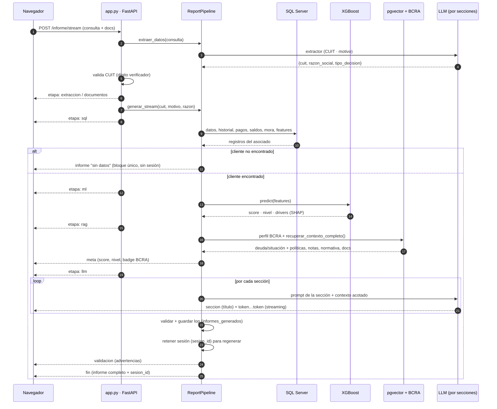

# Flujo de generación en streaming (SSE)

El informe se transmite al navegador **en vivo** mediante *Server-Sent Events*
(SSE). El endpoint `POST /informe/stream` (`app.py`) devuelve un
`StreamingResponse` de `text/event-stream`; cada evento es una línea
`data: {json}` seguida de doble salto de línea.

## Diagrama de secuencia

## Eventos SSE

| `tipo` | Cuándo | Campos |
|---|---|---|
| `etapa` | Al entrar en cada etapa | `clave`: `extraccion` \| `documentos` \| `sql` \| `ml` \| `rag` \| `llm` |
| `meta` | Una vez, antes del informe | `score`, `nivel`, `bcra`, `modelo`, `encontrado`, y (agregados por `app.py`) `numero`, `empresa`, `cuit`, `razon`, `motivo` |
| `seccion` | Al empezar cada sección | `titulo` |
| `token` | Repetido (streaming) | `texto` (incluye el encabezado `## …`) |
| `validacion` | Al terminar | `aprobado`, `advertencias[]` |
| `fin` | Cierre | `informe` (documento en orden de lectura), `sesion_id` |
| `error` | Ante fallo | `mensaje` |

> El **orden de transmisión** es el de ejecución (Clasificación, Historial…,
> Recomendación, Resumen). El evento `fin` trae el documento en **orden de
> lectura** (Resumen arriba), que es el que se usa para el render final y el PDF.

## Render en el navegador

- Durante el stream, los `token` se acumulan y se renderizan como Markdown
  agrupando por *frame* (`requestAnimationFrame`), no por token.
- En `fin`, el documento se parte por encabezados `## ` en **contenedores de
  sección independientes** (`renderInformePorSecciones`). Esto permite, en
  [modo admin](modo-admin.md), regenerar una sola sección in situ.
- El botón **Descargar PDF** re-renderiza el mismo Markdown en el servidor
  (`/api/informe/pdf-render`), así el PDF sale idéntico a lo que se ve.

## Endpoint app-to-app (sin streaming)

`POST /api/informe/pdf` recibe los campos ya estructurados
(`cuit`, `nombre`, `objetivo`), corre el pipeline y devuelve el **PDF** directo.
Reutiliza `generar_stream` internamente, por lo que también cubre el caso "sin
datos internos".
