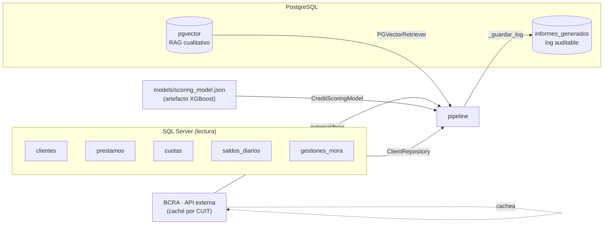
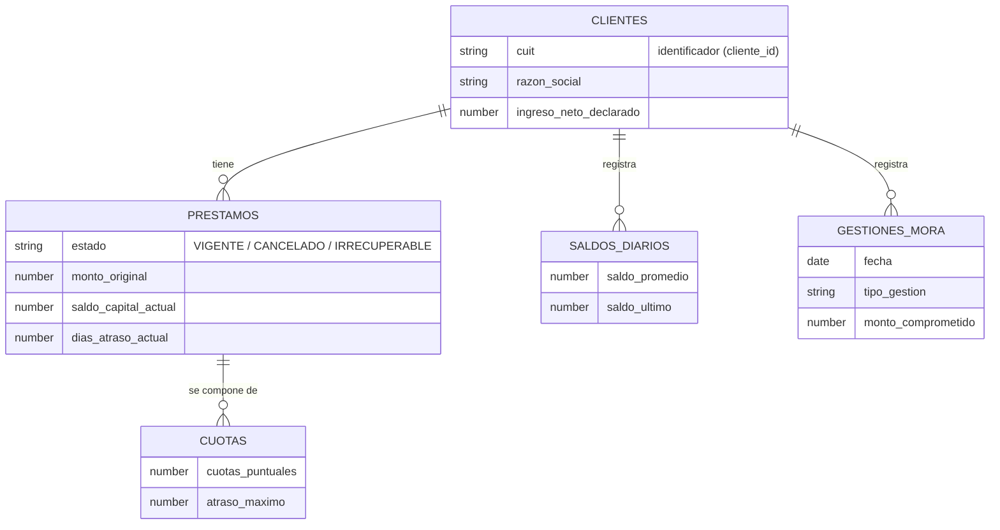
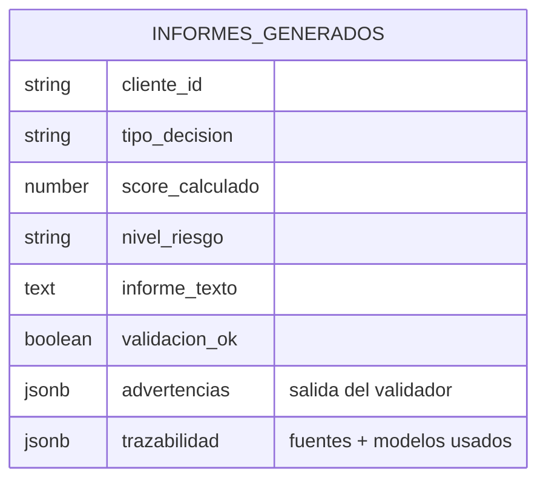

# Modelo de datos

El sistema combina **cuatro orígenes** de datos. Ninguno se modifica al generar un
informe, salvo el **log de auditoría** en Postgres y la **caché** del BCRA.

## 1. SQL Server — datos estructurados (fuente primaria)

Consultados por `ClientRepository` (`db/client_repository.py`). Relaciones del
dominio (los nombres de columnas exactos viven en el repositorio):

> Los atributos son **indicativos** de lo que consume el pipeline; el esquema
> exacto (columnas, tipos, joins) está en las consultas de `ClientRepository`.
> De aquí se derivan también las *features* del modelo (`construir_features_ml`).

## 2. PostgreSQL + pgvector — contexto cualitativo (RAG)

Embeddings (`bge-m3` u otro configurable) sobre texto, gestionados con
`langchain-postgres` (`PGVector`). `PGVectorRetriever.recuperar_contexto_completo`
devuelve, por similitud con el `tipo_decision`, cuatro conjuntos, más lo que se
indexa on-demand:

| Colección lógica | Origen | Se indexa en |
|---|---|---|
| `politicas` | Carpeta `politicas/` (reindexada al iniciar la app) | `pgvector_indexer` |
| `normativa` | Normativa cargada | `pgvector_indexer` |
| `notas_mora` | Notas cualitativas de mora | `pgvector_indexer` |
| `informes_previos` | Informes generados anteriormente | `pgvector_indexer` |
| `documentos_cliente` | PDFs/TXT adjuntos en la consulta | `indexar_documento_cliente` |
| `bcra` | Texto del perfil BCRA | `indexar_bcra` |

## 3. BCRA — Central de Deudores (opcional, externo)

`external/` consulta la API pública del BCRA por CUIT y **cachea** el resultado
(`BCRA_TTL_DIAS`, por defecto 30 días — el BCRA actualiza mensualmente). Aporta:
deuda total en el sistema, peor situación (escala 1–5), entidades, y cheques
rechazados/impagos. Se puede apagar con `BCRA_ENABLED=false` para operar 100%
on-premise.

## 4. Log de auditoría — `informes_generados` (Postgres)

Cada informe generado se registra (`pipeline._guardar_log`):

El campo `trazabilidad` deja registro auditable de **qué** se usó: fuentes SQL
Server, cantidad de fragmentos pgvector por tipo, consulta BCRA, y los modelos
(scoring, LLM, embeddings).

## Sesiones en memoria (efímero, no persistido)

Aparte de lo anterior, el pipeline mantiene en RAM (`_SESIONES`, últimas 20) el
contexto y las secciones de cada informe reciente, **solo** para permitir la
[regeneración de una sección](modo-admin.md) desde el modo admin. No es una base
de datos: se pierde al reiniciar.
