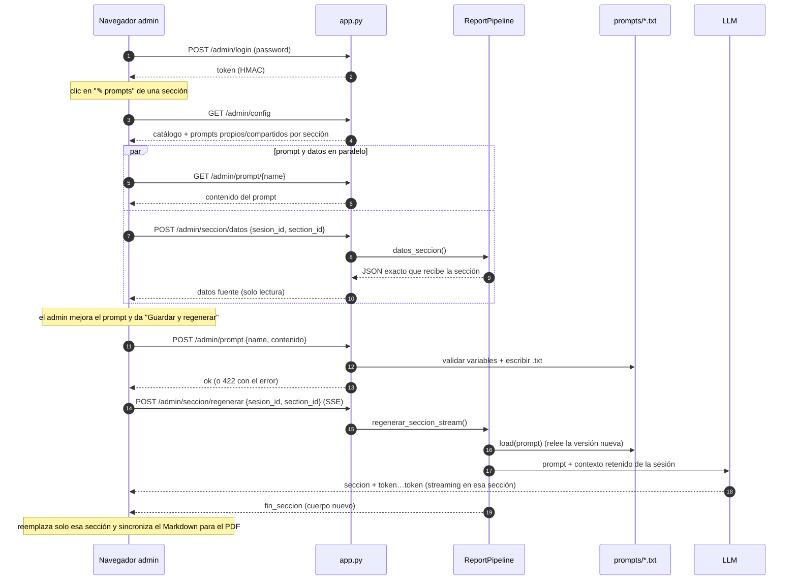

# Modo administrador

Permite a un usuario con rol admin **ver y editar los prompts** del sistema y,
desde el informe interactivo, **revisar el prompt de una sección junto a los
datos que la alimentan** y **regenerar solo esa sección** al guardar una mejora.

## Autenticación

- Contraseña compartida en `.env` → `ADMIN_PASSWORD`. **Si queda vacía, el modo
  admin se deshabilita por completo** (no aparece el botón ni funcionan los
  endpoints) — default seguro.
- Al iniciar sesión se entrega un **token** = `HMAC-SHA256(ADMIN_PASSWORD,
  "trabajo_ia_admin")`. Se verifica en tiempo constante y se envía en el header
  `X-Admin-Token`. No requiere estado en el servidor.

## Prompts editables

Los textos de los prompts viven en `prompts/*.txt` y se cargan en fresco con
`prompts.load()` en cada informe → editar un `.txt` impacta en el próximo informe
**sin reiniciar**. El catálogo (`prompts/__init__.py`) define, por prompt: título,
descripción, grupo, `modo` y `placeholders` permitidos.

**Validación al guardar** (`prompts.guardar`): el nombre debe estar en el catálogo
(whitelist → sin *path traversal*) y las variables `{...}` deben ser exactamente
las permitidas de ese prompt (ni faltantes ni de más, ni llaves sueltas), para no
romper las plantillas de LangChain / `str.format`.

### Mapa sección ↔ prompts

Toda sección usa las **reglas comunes** + su **prompt propio** + la **plantilla
del mensaje**. El editor contextual de una sección muestra solo el/los **propios**;
las reglas comunes (compartidas por todas) se editan desde el panel global.

| Sección (`section_id`) | Propio | Compartidos |
|---|---|---|
| Clasificación de Riesgo (`clasificacion`) | `seccion_clasificacion` | `secciones_base`, `seccion_human` |
| Historial Crediticio (`historial`) | — (sección por plantilla: la arma `llm/plantillas.py`, no el LLM; no tiene prompt editable) | — |
| Situación BCRA (`bcra`) | `seccion_bcra` | idem |
| Información Financiera (`financiera`) | `seccion_financiera` | idem |
| Cumplimiento de Políticas (`cumplimiento`) | `seccion_cumplimiento` | idem |
| Recomendación (`recomendacion`) | `recomendacion` | idem |
| Resumen Ejecutivo (`resumen`) | `resumen` | idem |

## Regeneración de una sola sección

Al terminar un informe, el pipeline **retiene en memoria** (por `sesion_id`) el
contexto ya formateado y el cuerpo de cada sección (`_SESIONES`, acotado a las
últimas 20, se limpia al reiniciar). Así se puede regenerar una sección **sin
re-consultar** SQL Server / ML / RAG / BCRA, releyendo el prompt del `.txt` (que
toma la edición del admin).

## Ver los datos fuente

Para decidir mejor al editar un prompt, el admin puede ver los datos reales que
alimentan el informe (es lo que recibe el modelo, en JSON, solo lectura):

- **Por sección** — desplegable *"📊 Ver los datos que recibe esta sección"* dentro
  del editor contextual. Muestra el contexto **exacto** de esa sección (p. ej.
  Clasificación recibe solo `scoring`; Recomendación incluye el cuerpo ya
  redactado de Cumplimiento, su dependencia).
- **Global** — botón **Datos** en la barra: todo el contexto del informe (cliente,
  historial, scoring, BCRA, RAG).

## Endpoints (todos exigen `X-Admin-Token`)

| Método | Ruta | Función |
|---|---|---|
| POST | `/admin/login` | Valida contraseña → token. |
| GET | `/admin/config` | Catálogo de prompts + mapa de secciones (propios/compartidos) + títulos. |
| GET | `/admin/prompt/{name}` | Contenido actual de un prompt. |
| POST | `/admin/prompt` | Guarda un prompt (valida variables; 422 si no valida). |
| POST | `/admin/seccion/datos` | Datos exactos que recibe una sección. |
| GET | `/admin/datos/{sesion_id}` | Todos los datos fuente del informe. |
| POST | `/admin/seccion/regenerar` | Regenera una sección (SSE). |

## Límites y notas

- La sesión vive en RAM del servidor (datos financieros); se limpia al reiniciar y
  se acota a las últimas 20. Regenerar sobre una sesión expirada devuelve un error
  controlado.
- Editar un prompt es un cambio **global** de archivo: vale para todos los
  informes futuros (comportamiento esperado).
- Regenerar `Cumplimiento` actualiza su cuerpo, pero `Recomendación`/`Resumen` no
  se recalculan en cascada; el admin puede regenerarlas después si quiere.
- El camino "sin datos internos" no crea sesión → no ofrece regeneración por
  sección.
