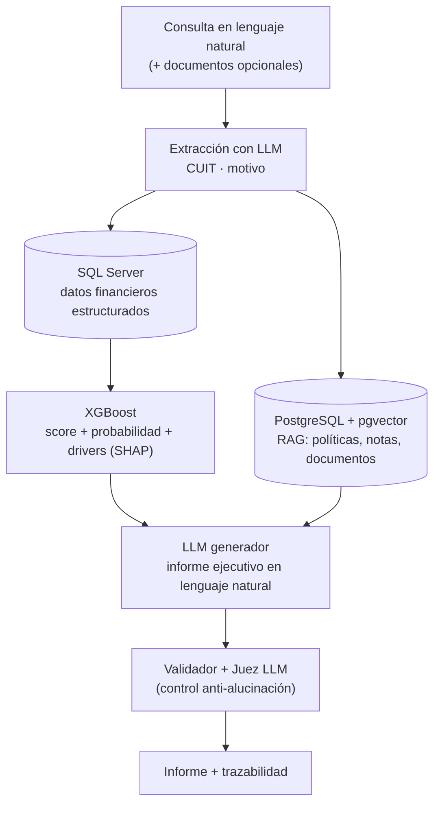

# Generador de Informes Crediticios con IA

Sistema que transforma una consulta en lenguaje natural sobre un asociado en un
**informe crediticio ejecutivo**, fundamentado en datos reales, explicable y
auditable, para asistir la toma de decisiones de crédito en una entidad
financiera (mutual / cooperativa de crédito).

> 📚 **Documentación técnica** (arquitectura, flujo de generación, modo
> administrador y modelo de datos, con diagramas): [`docs/`](docs/README.md).

---

## 1. El problema a resolver

Cuando un asociado solicita un crédito, alguien tiene que decidir si se aprueba.
Para eso, hoy hay que:

- Buscar y cruzar a mano datos dispersos en varios sistemas (préstamos, pagos,
  saldos, gestiones de mora).
- Interpretar información financiera cruda, que no es fácil de leer ni de
  resumir para quien decide.
- Redactar un informe que justifique la decisión, lo cual es **lento,
  inconsistente entre analistas y subjetivo**.

El resultado: decisiones más lentas y menos homogéneas, y un esfuerzo manual
que se repite en cada solicitud.

**Lo que hace falta:** un informe crediticio claro, objetivo y bien
fundamentado, generado en segundos a partir de los datos que la entidad ya
tiene, sin inventar nada y explicando *por qué* cada asociado obtiene su
resultado.

---

## 2. Cómo lo resolvemos

El analista escribe una consulta como
*"El asociado Juan Pérez, CUIT 23-25079318-9, solicita un crédito por 10 millones"*
(y opcionalmente adjunta documentos), y el sistema devuelve el informe completo dentro de una app web.

Por debajo, una **arquitectura de cuatro capas** combina lo cuantitativo
(modelo estadístico) con lo cualitativo (recuperación de contexto) y lo
redacta un modelo de lenguaje:



**Las cuatro capas:**

1. **Datos estructurados — SQL Server.** Historial de préstamos, comportamiento
   de pagos, saldos y gestiones de mora del asociado.
2. **Scoring ML — XGBoost.** Un modelo entrenado con datos históricos predice la
   probabilidad de incumplimiento y la traduce a un score (0–1000) con nivel de
   riesgo (semáforo).
3. **Contexto cualitativo — RAG con pgvector.** Búsqueda semántica sobre
   políticas internas de la entidad, notas, informes previos y documentos
   aportados, usando embeddings.
4. **Redacción — LLM.** Un modelo de lenguaje redacta el informe ejecutivo a
   partir de *todo* lo anterior.

**Cuatro decisiones de diseño que diferencian al producto:**

- **Anti-alucinación.** El LLM solo puede usar los datos provistos: tiene
  prohibido inventar o estimar números, y el informe se valida automáticamente
  (que el score aparezca, que estén las secciones, que cierre aclarando que la
  decisión final es humana). El dato lo pone el modelo estadístico; el lenguaje
  solo lo narra.
- **Explicabilidad por cliente (SHAP).** El informe no muestra importancias
  genéricas del modelo, sino los factores que pesaron en el score de *ese*
  asociado en particular, con su dirección ("aumenta / reduce el riesgo") y su
  peso. Clave para justificar una decisión individual y auditable.
- **Privacidad / on-premise.** Puede correr 100% local (LLM con Ollama +
  embeddings locales), de modo que los datos sensibles de los asociados **no
  salen de la institución**.
- **Prompts gobernables por el experto de dominio.** El informe se genera **por
  secciones**, con cada prompt en un archivo `.txt` editable. Un **modo
  administrador** deja revisar y mejorar el prompt de cada sección junto a los
  datos que la alimentan, y **regenerar solo esa sección** al guardar — sin tocar
  código ni reiniciar. Ver [`docs/modo-admin.md`](docs/modo-admin.md).

---

## 3. ¿Lo logramos?

Sí. El sistema funciona de punta a punta y genera informes crediticios reales.

- **Pipeline completo operativo:** de la consulta en lenguaje natural al informe
  ejecutivo, en una app web.
- **Modelo predictivo sólido:** AUC-ROC de **0.8653** en test.
- **Explicable:** cada informe expone los factores propios del asociado (SHAP).
- **Confiable:** reglas anti-alucinación + validador automático + un **juez
  LLM** (un modelo más potente que audita el informe contra los datos fuente y
  detecta inventos o números cambiados).
- **Privado y económico:** corre localmente sobre una Mac mini M4 Pro
  (GPU vía Metal), sin enviar datos a servicios externos.
- **Auditable:** cada informe queda registrado con su trazabilidad (modelos
  usados, fuentes, validación).
- **Con tests:** suite determinista (scoring, explicabilidad, validador,
  limpieza de datos) más la **evaluación automatizada** sobre un golden set
  (pass/fail agregado con juez LLM y RAGas — ver [docs/evaluacion.md](docs/evaluacion.md)).

---

## 4. ¿Qué continúa?

El sistema es funcional, y el trabajo a futuro apunta a robustez y rigor:

* **Rigor del modelo:** entrenamiento con **split temporal** y control de fuga de
  datos, calibración de probabilidades y bandas de riesgo — ver
  [docs/scoring.md](docs/scoring.md). *(Hecho)*
* **Evaluación objetiva:** **golden set** con pass/fail agregado, juez LLM y
  RAGas — ver [docs/evaluacion.md](docs/evaluacion.md). *(Hecho)*
* Correr el golden set de forma programada/periódica (CI) y monitoreo de deriva
  temporal del modelo en producción.
* Operación real con control humano.
---

## Stack técnico

| Capa | Tecnología |
|------|------------|
| App web | FastAPI (streaming SSE) |
| Datos estructurados | SQL Server |
| Scoring | XGBoost + SHAP |
| RAG / embeddings | PostgreSQL + pgvector, `bge-m3` / `Qwen3-Embedding` |
| LLM generador | Ollama `qwen3:14b` (local) · o Anthropic / OpenAI / Gemini |
| Juez (evaluación) | LLM más potente (configurable) |
| Orquestación | LangChain |
| Lenguaje / entorno | Python 3.11 (pyenv), macOS (Apple Silicon) |

---

## Estructura del proyecto

```
trabajo_ia/
├── .env                       # Variables de entorno (incl. ADMIN_PASSWORD)
├── requirements.txt           # Dependencias
├── app.py                     # App web: formulario, informe en streaming (SSE) y endpoints del modo admin
├── pipeline.py                # Orquestador del flujo + sesiones en memoria (regenerar secciones)
├── pdf_export.py              # Render del informe a PDF (Markdown → HTML → PDF)
├── sql/init_db.py             # Inicialización de la base (pgvector + tablas)
├── db/                        # Conexiones y ClientRepository (SQL Server / Postgres)
│   ├── sqlserver_connection.py
│   ├── postgres_connection.py
│   └── client_repository.py
├── ml/
│   ├── scoring_model.py       # Modelo XGBoost (score, nivel, drivers)
│   └── shap_explainer.py      # Explicabilidad por cliente (SHAP)
├── models/
│   └── scoring_model.json     # Modelo de scoring entrenado (artefacto)
├── rag/
│   ├── pgvector_indexer.py    # Indexación + embeddings + políticas
│   └── pgvector_retriever.py  # Recuperación de contexto cualitativo
├── external/                  # Integración BCRA (Central de Deudores) con caché
│   ├── bcra_client.py
│   ├── bcra_cache.py
│   └── bcra_normalizer.py
├── llm/
│   ├── generator.py           # Selección del modelo (local Ollama / Anthropic / OpenAI / Gemini)
│   └── report_sections.py     # Generación del informe POR SECCIONES (orquestación + regen)
├── prompts/                   # Textos de TODOS los prompts en .txt (editables sin tocar código)
│   ├── __init__.py            # load() + catálogo + guardar() con validación
│   ├── seccion_*.txt          # Instrucción de cada sección del informe
│   ├── secciones_base.txt     # Reglas comunes (anti-alucinación) + seccion_human.txt
│   ├── recomendacion.txt · resumen.txt
│   ├── sin_datos_*.txt        # Camino "sin datos internos"
│   ├── extractor_*.txt        # Extracción de la consulta en lenguaje natural
│   └── juez_*.txt             # Juez LLM
├── evaluation/
│   ├── llm_judge.py           # Juez LLM (auditoría de informes)
│   ├── run_judge.py           # Generar un informe y auditarlo (un CUIT)
│   ├── golden_set.json        # Golden set: casos + aserciones pass/fail
│   ├── muestrear_cuits.py     # Siembra el golden set con CUITs reales por banda
│   ├── metricas.py            # Aserciones deterministas + umbrales de juez/RAGas
│   ├── ragas_eval.py          # Métricas RAGas (faithfulness, answer_relevancy)
│   ├── run_golden.py          # Evaluación agregada sobre el golden set (CI)
│   ├── comparar_reportes.py   # Comparativa de generadores lado a lado
│   └── test_impletation.py    # Tests deterministas de la implementación
├── scripts/
│   ├── entrenar_modelo_temporal.py # Entrenar el scoring con split temporal (anti-fuga)
│   ├── entrenar_modelo_real.py # (previo) Entrenar el modelo de scoring
│   └── sync_bcra.py            # Sincronización/caché del BCRA
├── docs/                      # Documentación técnica (arquitectura, flujos, modelo de datos)
└── politicas/                 # Políticas de la entidad (se reindexan al iniciar)
```

---

## Cómo correrlo

```bash
# 1. Entorno
pyenv local 3.11.9
python -m venv venv311 && source venv311/bin/activate
pip install -r requirements.txt

# 2. Configurar credenciales y modelos en .env
#    (SQL Server, PostgreSQL, PROVEEDOR_LLM, EMBED_MODEL, etc.)
#    Para habilitar el modo administrador, definir ADMIN_PASSWORD
#    (si queda vacío, el modo admin se deshabilita).

# 3. LLM local
ollama pull qwen3:14b

# 4. Inicializar la base (pgvector + tablas)
python -m sql.init_db

# 5. Entrenar el modelo de scoring (una vez, con split temporal anti-fuga)
python scripts/entrenar_modelo_temporal.py

# 6. Levantar la app
uvicorn app:app --host 127.0.0.1 --port 8000
```

Para auditar **un** informe con el juez LLM:

```bash
python evaluation/run_judge.py 23-25079318-9 "Solicita crédito personal por 2 millones"
```

Para la **evaluación automatizada** sobre el golden set (pass/fail agregado, juez
LLM + RAGas — ver [docs/evaluacion.md](docs/evaluacion.md)):

```bash
pip install ragas datasets
python evaluation/muestrear_cuits.py --salida casos.json   # (una vez) sembrar CUITs reales por banda
python evaluation/run_golden.py          # correr todos los casos y agregar métricas
```

---

*Genera informes como insumo para la decisión; la decisión
crediticia final siempre corresponde a una persona (analista / directorio).*